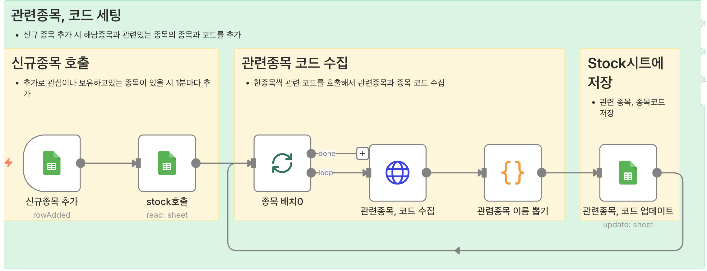
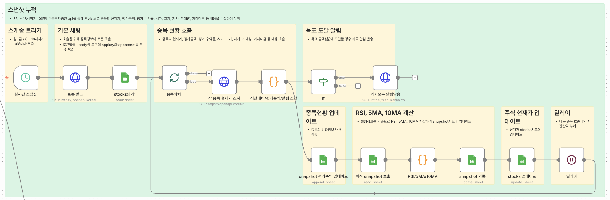
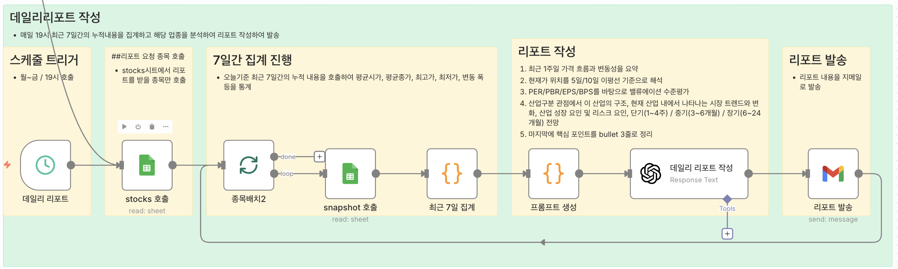
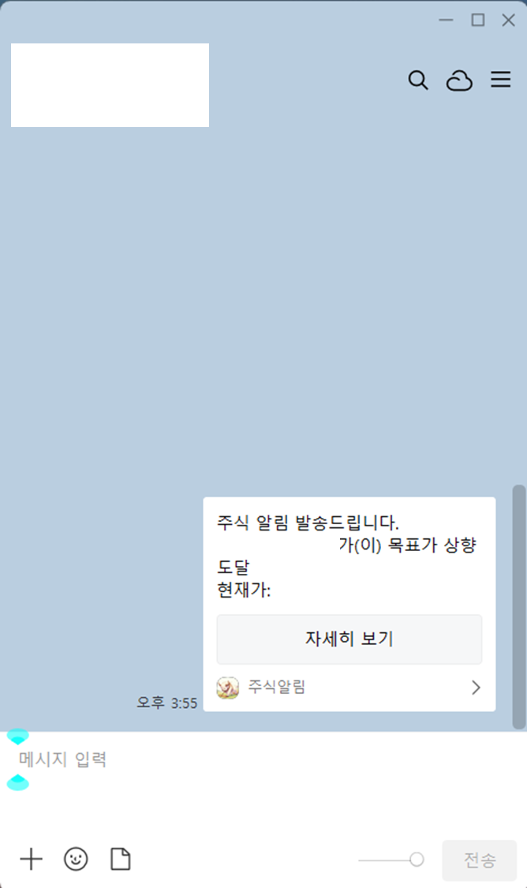

# Stock Portfolio Report

날짜: 2025년 11월 27일

> **관심/보유 종목 스냅샷 자동 수집 & 데일리 리포트 발송 시스템**
> 
> 
> 직장인 투자자나 초보 투자자는 실시간 가격 확인이나 꾸준한 데이터 기반 분석이 어렵다.
> 
> 이 시스템은 **관심/보유 종목을 자동으로 수집·누적하고, 매일 요약 리포트를 생성해 이메일로 발송하는 자동화 워크플로우**이다.
> 
> - 10분 단위 스냅샷 수집
> - 목표 가격/등락률 도달 시 카카오톡 알림
> - 매일 19시, 최근 7일 데이터를 기반으로 산업 전망 포함 데일리 리포트 생성
> - 모든 데이터는 Google Sheets에 구조적으로 저장

# 📋목차
0. 결과물
1. 문제정의
2. 예상 사용자
3. 사용방법
4. 사용비용(n8n 서버비용 제외)

---

# 0. 결과물

---

## 🔧 n8n 자동화 워크플로우

### 1) 신규 종목 등록 → 관련 종목 자동 매핑

종목코드 입력 시 관련 종목/산업(WICS)을 API로 조회해 DB에 자동 저장



### 2) 10분 주기 스냅샷 수집 + 알림

평일/ 오전 8시~오후 6시까지 주기적으로 시세 호출 → 누적

목표가/목표 등락률 도달 시 카카오톡 메시지 발송




### 3) 데일리 주식 리포트 생성

19시에 최근 7일 데이터를 집계 → OpenAI로 분석 리포트 작성 → Gmail 발송



## 🗃 Google Sheets DB 구조

스냅샷 데이터 누적


## 📧 결과물 예시

알림 메시지




# 1. 문제정의

---

### ❗ 기존의 문제점

- 매수 희망가 또는 목표 등락률을 실시간으로 보기 어렵다
- 매일 리포트를 직접 만들기 번거롭고 시간 소모가 크다
- 누적 분석을 위한 “데이터 히스토리”가 자동 저장되지 않는다
- 결과적으로 **데이터 기반 판단이 불가능**

### 💡 해결 방법 (핵심 기능)

- **10분 단위 실시간 스냅샷 수집 및 자동 누적**
- **목표 조건 달성 시 카카오톡 자동 알림**
- **최근 7일 데이터 기반의 AI 분석 리포트 자동 생성 및 이메일 발송**

# 2. 예상 사용자

---

- **직장인 투자자 (개미 투자자)**
    
    바쁜 일정 때문에 종목 확인이 어려워 자동 알림 + 요약 리포트를 원함
    
- **주린이(초보 개인 투자자)**
    
    내가 잘하고 있는지 알고 싶지만 데이터 해석이 어려운 사람
    

# 3. 사용방법

---

### 1. 주식 종목 등록

- DB의 stocks시트에 종목코드, 종목명, WISC작성
- 매수금액을 작성하지 않으면 자동으로 관심종목으로 작성

### 2. API

- [한국투자증권](https://apiportal.koreainvestment.com/intro)에서 api발급(appkey와 appsecret 복사)
- [OpenAI](https://openai.com/ko-KR/api/)에서 api발급(api키 복사)
- [Google api](https://console.cloud.google.com/welcome?hl=ko&project=prefab-episode-467010-v2) 발급(라이브러리: Gmail, google sheet)

### 3. 세팅

**토큰 발급 노드 - Send Body**

```jsx
{
  "grant_type": "client_credentials",
  "appkey": "한국투자증권 발급받은 appkey",
  "appsecret": "한국투자증권 발급받은 appsecret="
}
```

프롬프트 생성 노드 - 코드

```jsx
const stock  = $json;              
const agg    = stock['통계'] || {};
const latest = agg['최신스냅샷'] || {};

// 종목 기본 정보는 종목배치2에서 직접 가져오기
const name = $('종목배치2').first().json["종목명"] ?? '';
const code = $('종목배치2').first().json["종목코드"] ?? '';
const wics = $('종목배치2').first().json["WICS"] ?? '';

const systemPrompt = `
당신은 한국 주식 시장의 흐름을 설명하는 분석 전문가입니다.
투자 권유, 매수/매도 추천은 하지 말고,
관찰과 가능성 위주의 중립적인 톤으로 작성하세요.
아래 정보를 기반으로 다음과 같은 형식으로 상세하고 간결한 리포트를 작성해 주세요.
`;

const userPrompt = `
[기본 정보]
- 종목명: ${name} (${code})
- 산업명: ${wics}
- 현재가: ${latest['현재가'] ?? ''}
- PER: ${latest.PER ?? ''}, PBR: ${latest.PBR ?? ''}, EPS: ${latest.EPS ?? ''}, BPS: ${latest.BPS ?? ''}
- 시가총액: ${latest['시총'] ?? ''}

[최근 7일 요약]
- 평균 시가: ${agg['평균시가'] ?? ''}
- 평균 종가: ${agg['평균종가'] ?? ''}
- 최고/최저가: ${agg['최고가'] ?? ''} / ${agg['최저가'] ?? ''}
- 변동폭: ${agg['변동폭'] ?? ''}
- 평균 거래량: ${agg['평균거래량'] ?? ''}
- 종가 기준 변동성(표준편차): ${agg['변동성'] ?? ''}

[추가 지표]
- RSI: ${latest.RSI ?? ''}
- 5일 이평선: ${latest['5MA'] ?? ''}
- 10일 이평선: ${latest['10MA'] ?? ''}
- 외국인 보유: ${latest['외국인보유'] ?? ''}
- 외국인 순매수: ${latest['외국인순매수'] ?? ''}
- 프로그램 순매수: ${latest['프로그램순매수'] ?? ''}

위 데이터를 사용해서, 아래 양식을 그대로 유지한 리포트를 작성해 주세요.

📃종목 분석 리포트

[1] 한 줄 요약
- (이 종목의 현재 상황을 1~2문장으로 요약)

[2] 최근 7일 가격 흐름 및 변동성
- (위의 최근 7일 데이터만 사용해서 가격 흐름과 변동성을 2~4문장으로 설명)

[3] 현재가 위치 (5일/10일 이평선 기준)
- (현재가가 5일/10일 이평선 대비 위/아래 어디에 있는지,
   단기적인 흐름이 어떤지 2~4문장으로 설명.
   이평선 정보가 부족하면, 그 사실을 짧게 언급하고
   대신 평균 종가 등 다른 데이터로 합리적인 추론을 해줘.)

[4] 밸류에이션 분석 (PER/PBR/EPS/BPS)
- (PER/PBR/EPS/BPS 수치를 기반으로,
   적자/흑자 여부, 자산 대비 평가 수준 등을 2~4문장으로 설명.
   '고평가/저평가 확정' 보다는 특성을 분석하는 쪽으로 작성.)

[5] 산업 분석 (${wics} 기준)
- (산업명 "${wics}" 를 기준으로 산업 구조, 시장 트렌드,
   성장 요인과 리스크 요인, 단/중/장기 전망을 3~5문장으로 설명.
   '산업 정보가 제공되지 않는다' 같은 문장은 절대 쓰지 말 것.)

[6] 핵심 포인트 요약
- (투자자가 참고할 핵심 포인트를 3~5개 bullet로 정리. 각 항목은 한 문장으로.)
`;

// ⬅ 여기서 종목명/코드/WICS를 같이 넘겨주기
return [{
  json: {
    systemPrompt,
    userPrompt,
    종목명: name,
    종목코드: code,
    WICS: wics
  }
}];

```

### 4. 워크플로우  과정

1. 관련종목 및 코드 세팅
    
    관심/보유 종목 작성 → stocks시트에서 관련종목이 작성되어 있지 않은 행만 호출 → 종목 코드기준 관련종목과 코드 호출 → stocks시트에 업데이트
    
2. 스냅샷 누적
    
    평일 / 매10분마다 호출 → 토큰 발급 → stocks 주식종목 호출 → 주식 내용 수집 → snapshot에 누적 → 이전 snapshot내용 호출 → RSI, 5MA, 10MA 계산 및 snapshot업데이트 → 목표금액 및 목표 등락률 달성 시 카카오톡 알림
    
3. 데일리 리포트 작성
    
    평일 / 19시마다 호출 → stocks 주식종목 호출 → 주식종목과 일치하는 snapshot 호출 → 최근 7일 기록 집계 → 리포트 작성 → 리포트 발송
    

# 4. 사용비용(n8n 서버비용 제외)

---

| 내용 | 금액 |
| --- | --- |
| OpenAI | 0.0007614달러(한 종목/ 1회) |
| 카카오톡 메시지 | 무료 |
| Google API | 무료 |
